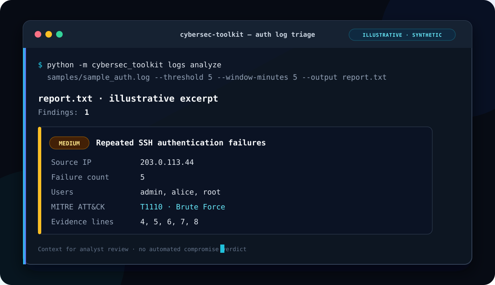
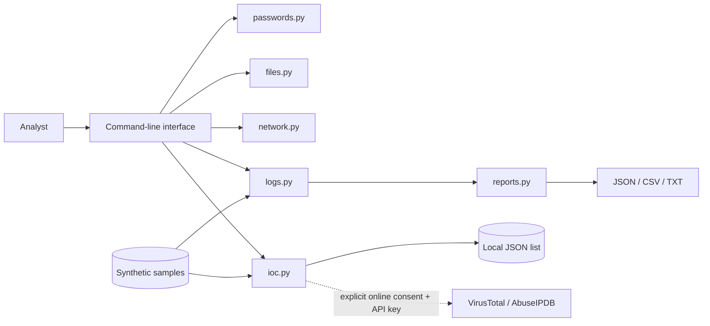

# Python Security Assessment Toolkit

[](https://www.python.org/)
[](LICENSE)
[](https://github.com/MuznaImran/python-security-assessment-toolkit/actions/workflows/tests.yml)

A defensive, standard-library Python toolkit for repeatable security checks: password hygiene, authorized TCP connectivity assessment, SHA-256 file-integrity monitoring, authentication-log triage, local-first indicator lookups, and portable finding reports.

The project is designed as a transparent learning and portfolio tool. It favors bounded behavior, explainable results, and secure defaults over aggressive scanning or automated verdicts. **Every bundled log entry, address, domain, and indicator is synthetic and intended only for demonstration and testing.**



> **Defensive scope:** Use this toolkit only on systems and data you own or have explicit permission to assess. It does not exploit services, attempt authentication, run payloads, or make vulnerability claims.

## Features

| Area | Capability | Defensive controls and interpretation |
| --- | --- | --- |
| Passwords | Cryptographically secure generation, character-policy controls, entropy estimate, and explainable strength feedback | Uses `secrets`; analysis is local and prompts without echoing the password |
| File security | Streaming SHA-256 hashing, portable integrity manifests, verification, and duplicate-hash comparison | Rejects traversal, unsafe manifest paths, symlinks, and duplicate entries |
| Network checks | DNS resolution, single-port connectivity checks, and concurrent TCP scans | One host per run; explicit `--authorized` acknowledgement; bounded ports, timeout, and workers |
| Log analysis | OpenSSH authentication-event parsing and repeated-failure detection | Rolling time windows, evidence line numbers, severity, and contextual [MITRE ATT&CK T1110](https://attack.mitre.org/techniques/T1110/) mapping |
| IOC lookup | Local comparison by default, with opt-in VirusTotal and AbuseIPDB lookups | Remote access requires an environment-based API key and explicit `--online` consent; every result remains contextual |
| Reporting | JSON, CSV, and plain-text exports | Deterministic, reviewable output suitable for follow-up analysis |

## Architecture



The CLI validates input and delegates to focused modules. Core functions also remain importable for tests, notebooks, or integration into a larger defensive workflow. Runtime functionality uses only the Python standard library.

## Installation

Requirements:

- Python 3.11 or newer
- Git

```bash
git clone https://github.com/MuznaImran/python-security-assessment-toolkit.git
cd python-security-assessment-toolkit
python -m venv .venv
```

Activate the virtual environment:

```bash
# Windows PowerShell
.venv\Scripts\Activate.ps1

# macOS or Linux
source .venv/bin/activate
```

The repository has no third-party runtime dependencies. You can run it directly:

```bash
python -m cybersec_toolkit --help
```

Optionally install it in editable mode to make the `cybersec` command available:

```bash
python -m pip install -e .
cybersec --help
```

The optional provider variables are documented in `.env.example`. That file is a template only: the CLI reads the **process environment** and does not automatically load `.env` files or depend on `python-dotenv`. Set only the key you need through your shell or preferred secret manager:

```powershell
# Windows PowerShell — applies to the current terminal session
$env:VIRUSTOTAL_API_KEY = "your-key"
$env:ABUSEIPDB_API_KEY = "your-key"
```

```bash
# macOS or Linux — applies to the current shell session
export VIRUSTOTAL_API_KEY="your-key"
export ABUSEIPDB_API_KEY="your-key"
```

Never commit real credentials. Leave both variables unset when using the default offline lookup.

## CLI usage

The examples below use the module form, so they work without installing the console script.

### Password hygiene

Generate a 20-character password and omit commonly confused characters:

```bash
python -m cybersec_toolkit password generate --length 20 --exclude-ambiguous
```

Analyze a password through a hidden terminal prompt:

```bash
python -m cybersec_toolkit password analyze
```

The rating and entropy estimate are educational heuristics. They do not check breach exposure or predict real cracking time.

### File hashing and integrity

```bash
# Hash one regular file
python -m cybersec_toolkit file hash README.md

# Create a trusted baseline for files under the current directory
python -m cybersec_toolkit file manifest-create --root . --output manifest.json README.md SECURITY.md

# Verify the current files against that baseline
python -m cybersec_toolkit file manifest-verify --root . manifest.json

# Find files with identical SHA-256 digests
python -m cybersec_toolkit file duplicates README.md SECURITY.md LICENSE
```

Store a baseline manifest somewhere an attacker cannot modify alongside the monitored files. A hash mismatch detects change; it does not explain who changed a file or whether the change is harmful.

### Authorized network checks

```bash
# Resolve one IP address or DNS name
python -m cybersec_toolkit network resolve localhost

# Check one TCP port
python -m cybersec_toolkit network check 127.0.0.1 443 --timeout 1

# Scan a small, explicit set of ports after confirming authorization
python -m cybersec_toolkit network scan 127.0.0.1 --ports 22,80,443 --authorized --timeout 0.5 --workers 16
```

An `open` result means only that a TCP connection succeeded. Displayed service names are conventional port hints, not service fingerprints or vulnerability findings.

### IOC lookup

Local JSON comparison is the default and makes no network request:

```bash
python -m cybersec_toolkit ioc lookup 203.0.113.42 --list samples/iocs.json
```

The included list contains documentation-only indicators from reserved example ranges. All sample IOCs are synthetic. The local command does not contact VirusTotal, AbuseIPDB, or any other external service.

After setting the matching environment variable, a remote lookup must name the provider and include `--online`:

```bash
# IP addresses, domains, URLs, and SHA-256 hashes
python -m cybersec_toolkit ioc lookup example.org --provider virustotal --online

# IP addresses only; reports from the last 90 days by default
python -m cybersec_toolkit ioc lookup 203.0.113.42 --provider abuseipdb --online --max-age-days 90
```

The consent flag is a real privacy boundary. A VirusTotal lookup sends the normalized indicator to VirusTotal over HTTPS and sends `VIRUSTOTAL_API_KEY` in the `x-apikey` header. An AbuseIPDB lookup sends the normalized IP address in the HTTPS query string and sends `ABUSEIPDB_API_KEY` in the `Key` header. The selected provider can therefore receive the submitted indicator, your network address, and account/request metadata, and may process them under its own terms and privacy policy. Do not submit internal hostnames, private investigation details, customer data, or any indicator you are not permitted to disclose.

Provider scores, report counts, classifications, and timestamps are external observations. Treat them as contextual leads: review freshness, provenance, ownership changes, false positives, and local telemetry before making a response decision.

### Authentication-log analysis and reports

Analyze a log and choose the report format through the required output extension:

```bash
python -m cybersec_toolkit logs analyze samples/sample_auth.log --threshold 5 --window-minutes 5 --output report.json
python -m cybersec_toolkit logs analyze samples/sample_auth.log --output report.csv
python -m cybersec_toolkit logs analyze samples/sample_auth.log --output report.txt
```

The detector maps repeated authentication failures to [MITRE ATT&CK T1110: Brute Force](https://attack.mitre.org/techniques/T1110/) as analyst context. A match is a triage signal; it does not establish intent, attribution, or compromise.

## Illustrative output

The following is a shortened, **illustrative** rendering based on the repository's synthetic sample log. It is not a captured production run.

```text
$ python -m cybersec_toolkit logs analyze samples/sample_auth.log --threshold 5 --window-minutes 5 --output report.txt
{
  "findings": 1,
  "report": "report.txt",
  "note": "Findings are triage leads and require analyst review."
}

Security Assessment Findings
============================
Findings: 1

SSH-BRUTE-001: Repeated SSH authentication failures
Severity: medium
Source IP: 203.0.113.44
Failure count: 5
Usernames: admin, alice, root
ATT&CK mapping: MITRE ATT&CK T1110 (Brute Force, contextual mapping)
Evidence lines: 4, 5, 6, 7, 8
```

Exact formatting may vary as the CLI evolves. Generated passwords, resolved addresses, timestamps, and live network states naturally vary between runs.

## Project structure

```text
python-security-assessment-toolkit/
├── .github/workflows/tests.yml    # Python 3.11 and 3.13 CI
├── cybersec_toolkit/
│   ├── __main__.py                # `python -m` entry point
│   ├── cli.py                     # Argument parsing and terminal output
│   ├── passwords.py               # Password generation and analysis
│   ├── files.py                   # Hashing and integrity manifests
│   ├── network.py                 # Bounded TCP connectivity checks
│   ├── logs.py                    # Authentication-log detection
│   ├── ioc.py                     # Local and opt-in provider IOC lookup
│   └── reports.py                 # JSON, CSV, and text exports
├── docs/demo.svg                  # Illustrative terminal preview
├── samples/
│   ├── iocs.json                  # Synthetic indicators
│   └── sample_auth.log            # Synthetic OpenSSH-style events
├── tests/                         # Offline unit tests
├── .env.example                   # Optional provider variable names only
├── main.py                        # Alternate direct entry point
├── SECURITY.md                    # Security and responsible-use guidance
├── pyproject.toml                 # Package metadata and console script
└── LICENSE                        # MIT License
```

## Testing

Run the complete offline test suite:

```bash
python -m unittest discover -s tests -v
```

Check that all Python sources compile:

```bash
python -m compileall -q cybersec_toolkit main.py
```

Network tests use loopback sockets and mocks; they do not scan public hosts. GitHub Actions runs the suite on Python 3.11 and 3.13 for pushes and pull requests.

## Security considerations

- **Authorization is mandatory.** Network scanning requires `--authorized`, accepts one target, and caps the number of ports, workers, and timeout.
- **Secrets stay local.** Password analysis uses a hidden prompt. Do not pass real passwords as shell arguments, paste them into issues, or record them in terminal demos.
- **Baselines need protection.** Integrity checks are only trustworthy when the original manifest is stored securely and reviewed before acceptance.
- **Indicators need context.** A local-list match, provider score, or absence is not a reputation verdict. Validate source quality, age, false positives, ownership, and the surrounding event evidence.
- **Online lookup discloses the indicator.** `--online` sends it to the selected external provider. Review authorization, classification, provider policy, and investigation sensitivity before opting in.
- **API keys belong in the environment.** The CLI reads `VIRUSTOTAL_API_KEY` or `ABUSEIPDB_API_KEY` from the current process. Keep keys out of commands, source files, reports, screenshots, issues, and commits.
- **Reports may be sensitive.** Review exports before sharing or committing them; source IPs, usernames, filenames, and timestamps can reveal internal details.
- **Samples are synthetic.** Reserved documentation ranges and invented events prevent the bundled examples from making claims about real people, systems, or infrastructure.

See [SECURITY.md](SECURITY.md) for responsible reporting and additional operational guidance.

## Ethical usage

Use the toolkit for learning, blue-team validation, lab exercises, and expressly authorized assessments. Obtain written permission before testing infrastructure that is not yours. Follow applicable laws, organizational policy, assessment scope, rate limits, and data-handling requirements. Do not use the scanner for unsolicited Internet reconnaissance or use any module to harass, disrupt, evade controls, or gain unauthorized access.

## Limitations

- The scanner performs TCP connect checks; it does not fingerprint services, test vulnerabilities, send application payloads, or attempt credentials.
- Password scoring and entropy output are estimates, not guarantees of resistance to guessing or credential reuse attacks.
- Log analysis currently targets a documented subset of timestamped OpenSSH authentication messages and may not cover every distribution or log format.
- Local IOC analysis is only as current and accurate as the supplied list. Optional provider results depend on third-party availability, coverage, rate limits, account access, and data freshness, and do not establish compromise or safety.
- SHA-256 integrity checks detect content changes but do not provide signer identity, provenance, or automatic remediation.
- Findings require analyst review and should be correlated with trusted telemetry before response action.

## Roadmap

- Add signed or keyed integrity manifests for stronger baseline authenticity
- Support additional authentication-log formats with fixture-based parsers
- Add provider-response caching controls and additional opt-in intelligence adapters
- Export findings to interoperable formats such as SARIF or STIX
- Add a small defensive dashboard without weakening CLI safeguards
- Publish versioned releases and expanded user documentation

## License

Released under the [MIT License](LICENSE). Copyright © 2026 Muzna Imran.
